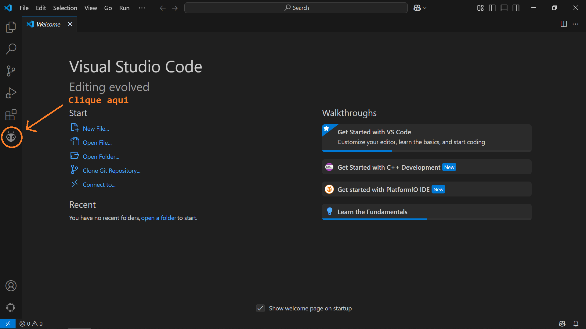
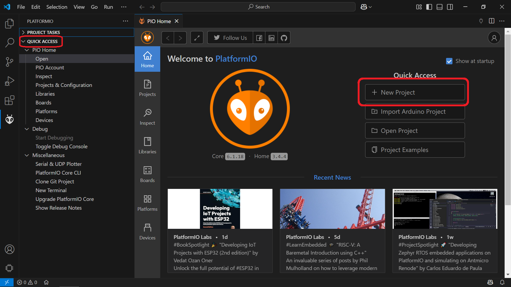
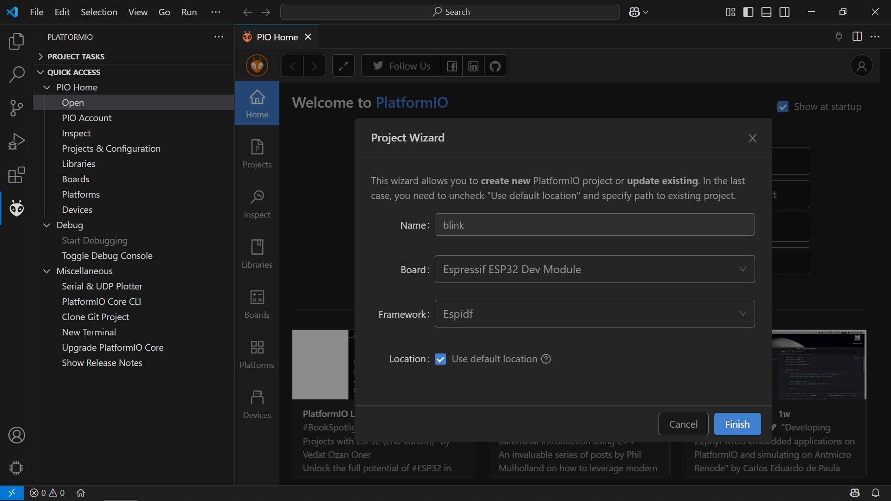
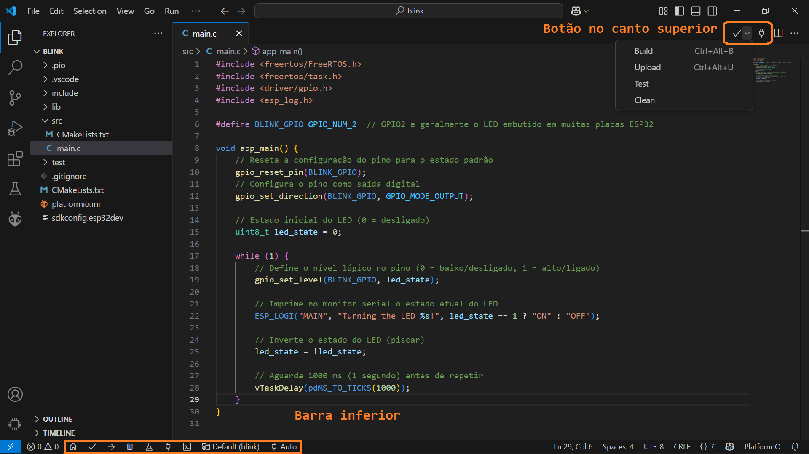
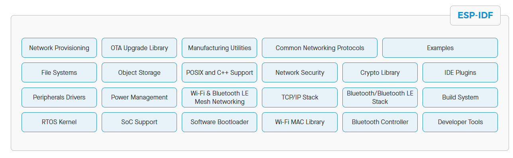

# Ambiente de Desenvolvimento
Apresentação das ferramentas utilizadas para desenvolvimento das atividades da disciplina.

## Visual Studio Code
O [VS Code](https://code.visualstudio.com/docs) é um editor de código-fonte desenvolvido pela Microsoft, conhecido por sua grande quantidade de extensões e facilidade de personalização para desenvolver com diversas stacks de tecnologias. Entre tantas outras funcionalidades, possui suporte a diversas linguagens de programação, incluindo C/C++, integração com ferramentas de versionamento de código, sistema de depuração, ferramentas para testes, entre outras.

Para instalar o VS Code, acesse o [site oficial](https://code.visualstudio.com/Download) e faça o download do instalador para o seu sistema operacional. Além disso, é necessario instalar algumas extensões no editor para trabalhar com as placas de prototipação:

- [Extensão C/C++](https://marketplace.visualstudio.com/items?itemName=ms-vscode.cpptools-extension-pack): reúne ferramentas essenciais para o desenvolvimento em C/C++, oferecendo suporte para edição, compilação e depuração, autocompletar e navegação em projetos.
- [Extensão PlatformIO IDE](https://marketplace.visualstudio.com/items?itemName=platformio.platformio-ide): ecosssistema de ferramentas voltada para programação embarcada, oferece um ambiente para desenvolver em uma ampla variedade de microcontroladores e placas.

## PlatformIO IDE
O [PlatformIO IDE](https://docs.platformio.org/en/latest/) é um ambiente de desenvolvimento integrado para firmware e IoT, voltado para programação embarcada de forma profissional e moderna. Os principais recursos incluem:

- Suporte a várias placas de prototipação e plataformas de desenvolvimento.
- Ferramentas de depuração
- Ferramentas de testes
- Analisador de código estático
- Gereciador de bibliotecas
- Desenvolvimento remoto

Antes de prosseguir, verifique os [requisitos](https://docs.platformio.org/en/latest/core/installation/requirements.html) de sistema para extensão do platformIO IDE funcionar corretamente. Após a instalação e inicialização com sucesso, existem algumas formas para criar um novo projeto. A forma mais simples é através da interface gráfica do editor, acessando na barra lateral o icone do PlatformIO IDE.



Em seguida, selecione a opção "Quick Acess > Pio Home > Open" e uma nova aba será aberta na interface do VS Code. Nessa nova aba, clique em "New Project", para abrir um poup-up com opções para criar um novo projeto.



No pop-up, tem-se quatro opções para criar um novo projeto, depois de preencher os campos, clique em *Finish*:

- **Name**: nome do projeto e nome do diretório onde o projeto será criado, escolha um nome que identifique o projeto.
- **Board**: placa de prototipação a ser utilizada, selecione *Espressif ESP32 Dev Module*.
- **Framework**: framework de desenvolvimento a ser utilizado, selecione *Espidf*.
- **Location**: local onde o projeto será criado, escolha uma pasta facilmente acessível.



Esse processo pode demorar alguns minutos para ser concluído, após isso, o projeto estará criado e pronto para ser editado. Copie o código abaixo e cole no arquivo *src/main.c* para testar a placa. O código faz o LED embutido na placa piscar a cada 1 segundo.

```c
#include <freertos/FreeRTOS.h>      
#include <freertos/task.h>          
#include <driver/gpio.h>           
#include <esp_log.h>              

#define BLINK_GPIO GPIO_NUM_2  // GPIO2 é geralmente o LED embutido em muitas placas ESP32

void app_main() {
    // Reseta a configuração do pino para o estado padrão
    gpio_reset_pin(BLINK_GPIO);
    // Configura o pino como saída digital
    gpio_set_direction(BLINK_GPIO, GPIO_MODE_OUTPUT);
    
    // Estado inicial do LED (0 = desligado)
    uint8_t led_state = 0;

    while (1) {
        // Define o nível lógico no pino (0 = baixo/desligado, 1 = alto/ligado)
        gpio_set_level(BLINK_GPIO, led_state);
        
        // Imprime no monitor serial o estado atual do LED
        ESP_LOGI("MAIN", "Turning the LED %s!", led_state == 1 ? "ON" : "OFF");

        // Inverte o estado do LED (piscar)
        led_state = !led_state;

        // Aguarda 1000 ms (1 segundo) antes de repetir
        vTaskDelay(pdMS_TO_TICKS(1000));
    }
}
```

Algumas operações frequentes podem ser realizados através da barra inferior ou de um botão no canto superior direito do editor:



<div style="display: flex; flex-direction: column; gap: 8px; margin-left: 4px; margin-bottom: 16px;">
        <div style="display: flex; align-items: flex-start; gap: 8px;">
            <svg xmlns="http://www.w3.org/2000/svg" width="16" height="16" viewBox="0 0 24 24" fill="none" stroke="currentColor" stroke-width="3" stroke-linecap="round" stroke-linejoin="round" class="lucide lucide-house-icon lucide-house"><path d="M15 21v-8a1 1 0 0 0-1-1h-4a1 1 0 0 0-1 1v8"/><path d="M3 10a2 2 0 0 1 .709-1.528l7-5.999a2 2 0 0 1 2.582 0l7 5.999A2 2 0 0 1 21 10v9a2 2 0 0 1-2 2H5a2 2 0 0 1-2-2z"/></svg>
            <span><strong>Home:</strong> abrir a página inicial do PlatformIO IDE</span>
        </div>
        <div style="display: flex; align-items: flex-start; gap: 8px;">
            <svg xmlns="http://www.w3.org/2000/svg" width="16" height="16" viewBox="0 0 24 24" fill="none" stroke="currentColor" stroke-width="3" stroke-linecap="round" stroke-linejoin="round" class="lucide lucide-check-icon lucide-check"><path d="M20 6 9 17l-5-5"/></svg>
            <span><strong>Build:</strong> compila e constrói o projeto para o microcontrolador alvo.</span>
        </div>
        <div style="display: flex; align-items: flex-start; gap: 8px;">
            <svg xmlns="http://www.w3.org/2000/svg" width="16" height="16" viewBox="0 0 24 24" fill="none" stroke="currentColor" stroke-width="3" stroke-linecap="round" stroke-linejoin="round" class="lucide lucide-arrow-right-icon lucide-arrow-right"><path d="M5 12h14"/><path d="m12 5 7 7-7 7"/></svg>
            <span><strong>Upload:</strong> envia o código compilado para a placa conecta via porta USB no host.</span>
        </div>
        <div style="display: flex; align-items: flex-start; gap: 8px;">
            <svg xmlns="http://www.w3.org/2000/svg" width="16" height="16" viewBox="0 0 24 24" fill="none" stroke="currentColor" stroke-width="3" stroke-linecap="round" stroke-linejoin="round" class="lucide lucide-trash2-icon lucide-trash-2"><path d="M3 6h18"/><path d="M19 6v14c0 1-1 2-2 2H7c-1 0-2-1-2-2V6"/><path d="M8 6V4c0-1 1-2 2-2h4c1 0 2 1 2 2v2"/><line x1="10" x2="10" y1="11" y2="17"/><line x1="14" x2="14" y1="11" y2="17"/></svg>
            <span><strong>Clean:</strong> remove arquivos de compilação anteriores do projeto.</span>
        </div>
        <div style="display: flex; align-items: flex-start; gap: 8px;">
            <svg xmlns="http://www.w3.org/2000/svg" width="16" height="16" viewBox="0 0 24 24" fill="none" stroke="currentColor" stroke-width="3" stroke-linecap="round" stroke-linejoin="round" class="lucide lucide-flask-conical-icon lucide-flask-conical"><path d="M14 2v6a2 2 0 0 0 .245.96l5.51 10.08A2 2 0 0 1 18 22H6a2 2 0 0 1-1.755-2.96l5.51-10.08A2 2 0 0 0 10 8V2"/><path d="M6.453 15h11.094"/><path d="M8.5 2h7"/></svg>
            <span><strong>Test:</strong> executa testes automatizados no projeto.</span>
        </div>
        <div style="display: flex; align-items: flex-start; gap: 8px;">
            <svg xmlns="http://www.w3.org/2000/svg" width="16" height="16" viewBox="0 0 24 24" fill="none" stroke="currentColor" stroke-width="3" stroke-linecap="round" stroke-linejoin="round" class="lucide lucide-plug-icon lucide-plug"><path d="M12 22v-5"/><path d="M9 8V2"/><path d="M15 8V2"/><path d="M18 8v5a4 4 0 0 1-4 4h-4a4 4 0 0 1-4-4V8Z"/></svg>
            <span><strong>Serial Monitor:</strong> exibe dados enviados pela placa via porta serial.</span>
        </div>
        <div style="display: flex; align-items: flex-start; gap: 8px;">
            <svg xmlns="http://www.w3.org/2000/svg" width="16" height="16" viewBox="0 0 24 24" fill="none" stroke="currentColor" stroke-width="3" stroke-linecap="round" stroke-linejoin="round" class="lucide lucide-square-terminal-icon lucide-square-terminal"><path d="m7 11 2-2-2-2"/><path d="M11 13h4"/><rect width="18" height="18" x="3" y="3" rx="2" ry="2"/></svg>
            <span><strong>Terminal:</strong> terminal integrado do PlatformIO para executar comandos no ambiente do projeto.</span>
        </div>
        <div style="display: flex; align-items: flex-start; gap: 8px;">
            <svg xmlns="http://www.w3.org/2000/svg" width="16" height="16" viewBox="0 0 24 24" fill="none" stroke="currentColor" stroke-width="3" stroke-linecap="round" stroke-linejoin="round" class="lucide lucide-folder-clock-icon lucide-folder-clock"><circle cx="16" cy="16" r="6"/><path d="M7 20H4a2 2 0 0 1-2-2V5a2 2 0 0 1 2-2h3.9a2 2 0 0 1 1.69.9l.81 1.2a2 2 0 0 0 1.67.9H20a2 2 0 0 1 2 2"/><path d="M16 14v2l1 1"/></svg>
            <span><strong>Env:</strong> seleciona o ambiente definido no arquivo <code>platformio.ini</code>.</span>
        </div>
        <div style="display: flex; align-items: flex-start; gap: 8px;">
            <svg xmlns="http://www.w3.org/2000/svg" width="16" height="16" viewBox="0 0 24 24" fill="none" stroke="currentColor" stroke-width="3" stroke-linecap="round" stroke-linejoin="round" class="lucide lucide-plug-icon lucide-plug"><path d="M12 22v-5"/><path d="M9 8V2"/><path d="M15 8V2"/><path d="M18 8v5a4 4 0 0 1-4 4h-4a4 4 0 0 1-4-4V8Z"/></svg>
           <span><strong>Port:</strong> seleciona a porta serial usada para comunicação com a placa.</span>
        </div>
</div>

Para testar o funcionamento do ambiente de desenvolvimento, compile o projeto (***build***) e enviar o código para a placa (***upload***). Após o upload, abra o monitor serial (***serial monitor***) e verifique se a mensagem "Turning the LED ON!" e "Turning the LED OFF!" estão sendo exibidas a cada segundo.

## ESP-IDF
O [ESP-IDF](https://docs.espressif.com/projects/esp-idf/en/stable/esp32/index.html) é o framework oficial de desenvolvimento para IoT da Espressif, voltado para as séries de SoCs ESP32, ESP32-S e ESP32-C. Ele oferece um SDK autossuficiente para o desenvolvimento de qualquer aplicação genérica nessas plataformas, utilizando linguagens de programação como C/C++.

